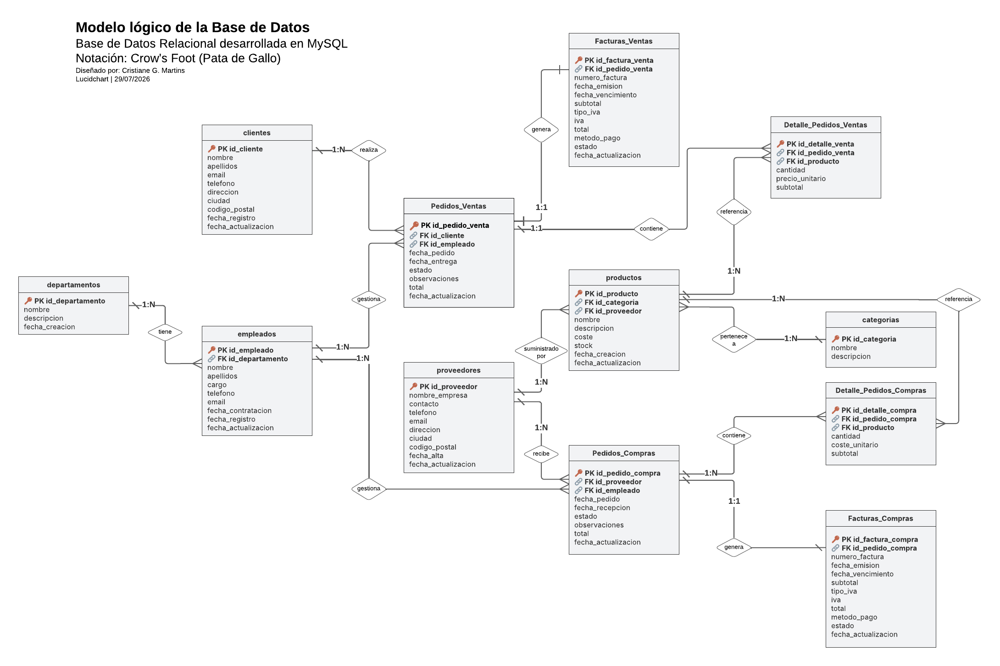
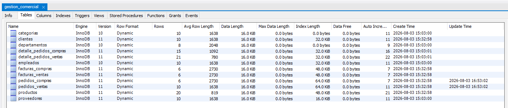
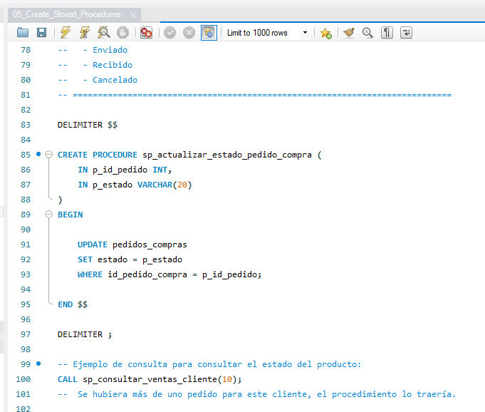
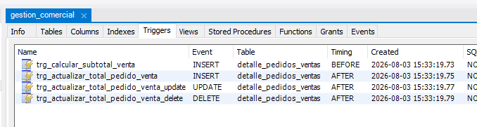
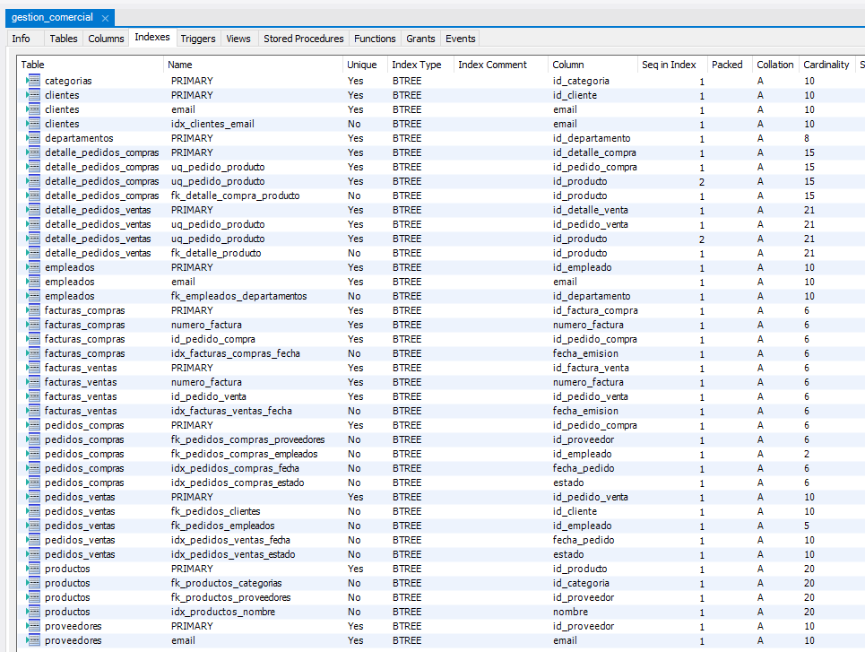
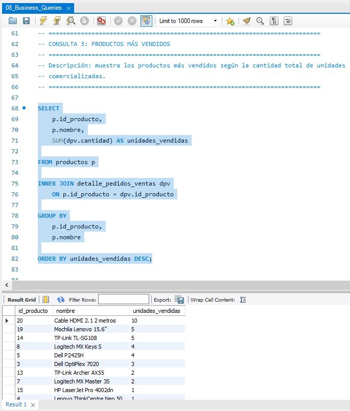
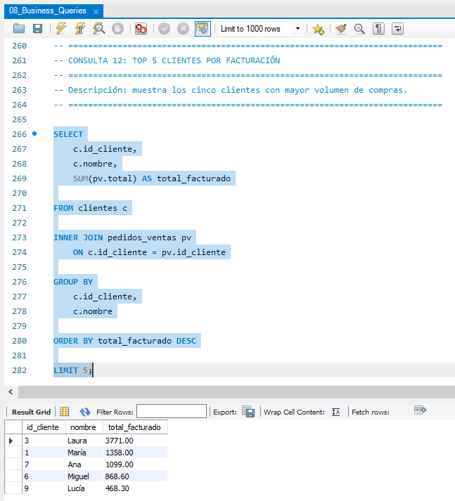
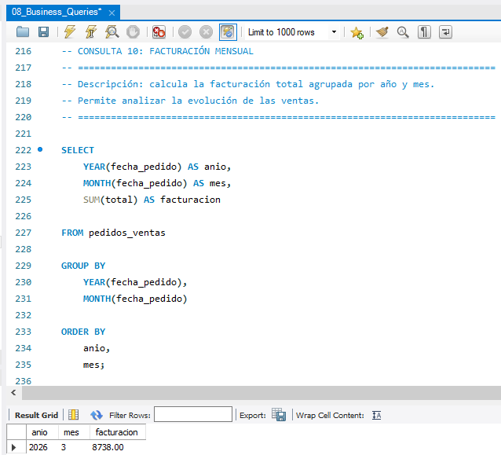

# SISTEMA DE GESTIÓN COMERCIAL
Base de datos relacional desarrollada en MySQL

Autor: Cristiane G. Martins
Proyecto desarrollado como parte de mi portafolio de Data Analytics y Business Intelligence.

## Descripción
Este proyecto consiste en el diseño e implementación de una base de datos relacional desarrollada en MySQL, orientada a la gestión de los procesos comerciales de una empresa.
La solución integra los procesos de ventas, compras, gestión de productos, clientes, proveedores y estructura organizativa, aplicando principios de normalización, integridad referencial y buenas prácticas de modelado de datos.

Aunque el proyecto se originó como una actividad académica, fue ampliado y rediseñado para representar un escenario empresarial real, aplicando buenas prácticas de modelado, integridad referencial y automatización mediante SQL.

## Objetivos
· Diseñar una base de datos relacional escalable.  
· Aplicar las tres primeras formas normales (3NF).  
· Garantizar la integridad referencial mediante claves primarias y foráneas.  
· Modelar los procesos de ventas y compras de forma independiente.  
· Implementar una estructura fácilmente ampliable.  
· Documentar completamente el modelo de datos.  

## Caso de negocio
Una empresa dedicada a la comercialización de productos necesita centralizar la gestión de su actividad comercial.
El sistema debe permitir:

· Gestionar clientes.  
· Administrar proveedores.  
· Mantener un catálogo de productos.  
· Organizar los productos por categorías.  
· Registrar pedidos de venta.  
· Registrar pedidos de compra.  
· Emitir facturas de venta.  
· Registrar facturas de compra.  
· Gestionar empleados y departamentos.  

El modelo ha sido diseñado pensando en una futura integración con herramientas de análisis como Power BI o sistemas ERP.

## Tecnologías utilizadas

| Tecnología         | Uso                      |
|--------------------|--------------------------|
| MySQL 8.0          | Motor de base de datos   |
| SQL                | Desarrollo de consultas  |
| MySQL Workbench    | Diseño y administración  |
| Lucidchart         | Modelo Entidad-Relación  |
| Visual Studio Code | Edición de scripts       |
| Git                | Control de versiones     |
| GitHub             | Publicación del proyecto |

## Modelo de Datos (ER + tablas)

La base de datos se estructura en cuatro áreas funcionales:

Gestión Comercial  
· clientes  
· pedidos_ventas  
· detalle_pedidos_ventas  
· facturas_ventas  

Gestión de Compras  
· proveedores  
· pedidos_compras  
· detalle_pedidos_compras  
· facturas_compras  

Gestión de Productos  
· productos  
· categorias  

Gestión Organizativa  
· empleados  
· departamentos  

## Reglas de Negocio  
· Un cliente puede realizar múltiples pedidos de venta.  
· Un proveedor puede recibir múltiples pedidos de compra.  
· Cada pedido debe contener al menos un detalle.  
· Cada producto pertenece a una única categoría.  
· Cada producto tiene un proveedor principal.  
· Cada empleado pertenece a un único departamento.  
· Cada factura está asociada a un único pedido.  
· El importe total de la factura se calcula como:  

**Total = Subtotal + IVA**  

# Estructura del proyecto

Sistema_de_Gestion_Comercial_MySQL  
│
├── README.md 
├── Data_Dictionary.md 
├── SQL_scripts/   
│   ├── 01_Create_Database |Creación de la base de datos.|  
│   ├── 02_Create_Tables |Creación de tablas, claves primarias, foráneas y restricciones.|  
│   ├── 03_Insert_Data |Carga de datos de prueba.|  
│   ├── 04_Create_Indexes |Creación de índices para optimizar consultas.|  
│   ├── 05_Create_Stored_Procedures |Procedimientos almacenados.|  
│   ├── 06_Create_Triggers |Triggers para automatizar cálculos y actualizaciones.|  
│   ├── 07_Update_Totals |Consultas de negocio para análisis.|  
│   ├── 08_Business_Queries |Actualización de importes tras la carga inicial.|  
├── Imagenes/  
├── 01_er_diagram.png
├── 02_tables.png
├── 03_indexes.png
├── 04_stored_procedures.png
├── 05_triggers.png
├── 06_business_query_top_productos.png
├── 07_business_query_clientes_facturacion.png
└── 08_business_query_facturacion_mensual.png

## Estructuras de las tablas

## Relaciones del Modelo  
✔︎ Cliente realiza pedidos de venta.  
✔︎ Empleado gestiona pedidos de venta.  
✔︎ Pedido de venta contiene múltiples líneas de detalle.  
✔︎ Cada línea corresponde a un producto.  
✔︎ Cada pedido genera una factura de venta.  
✔︎ Proveedor suministra productos.  
✔︎ Los productos pertenecen a una categoría.  
✔︎ Proveedor recibe pedidos de compra.  
✔︎ Empleado gestiona pedidos de compra.  
✔︎ Pedido de compra contiene múltiples líneas de detalle.  
✔︎ Cada pedido genera una factura de compra.  
✔︎ Departamento agrupa empleados.  

## Funcionalidades implementadas

### Procedimientos almacenados
Se desarrollaron procedimientos almacenados para automatizar operaciones frecuentes, como la consulta 
de ventas por cliente y la actualización del estado de los pedidos, centralizando la lógica de negocio dentro de la base de datos.

### Triggers
Se implementaron triggers para mantener la consistencia de los datos, actualizando automáticamente el importe total 
de los pedidos cuando se insertan nuevas líneas de detalle.

### Índices
Se implementaron índices para optimizar las consultas más frecuentes.

### Restricciones CHECK
Se definieron restricciones CHECK para validar los datos introducidos, garantizando que determinados campos solo acepten valores 
permitidos y reforzando la calidad de la información almacenada.

### Claves foráneas
Se implementaron claves foráneas para establecer las relaciones entre las entidades del sistema y garantizar la consistencia de los datos mediante integridad referencial.

### Integridad referencial
El modelo impide la inserción o eliminación de registros que vulneren las relaciones entre tablas, asegurando la coherencia de la información en todas las operaciones.

### Actualización automática de importes
Tras la carga inicial de datos, se ejecuta un script de actualización que recalcula los importes existentes. A partir de ese momento, los triggers mantienen automáticamente los totales sincronizados con el detalle de cada pedido.

### Consultas de negocio
Se desarrollaron varias consultas orientadas al análisis empresarial, simulando informes 
habituales en sistemas ERP y herramientas de Business Intelligence.

✔︎ Top productos vendidos  
Permite identificar los productos con mayor volumen de ventas para apoyar la toma de decisiones comerciales y de inventario.

✔︎ Clientes con mayor facturación  
Muestra los clientes que generan un mayor volumen de ingresos, facilitando el análisis de rentabilidad y fidelización.

✔︎ Facturación mensual  
Resume la facturación por año y mes, proporcionando una visión temporal de la evolución de las ventas.

